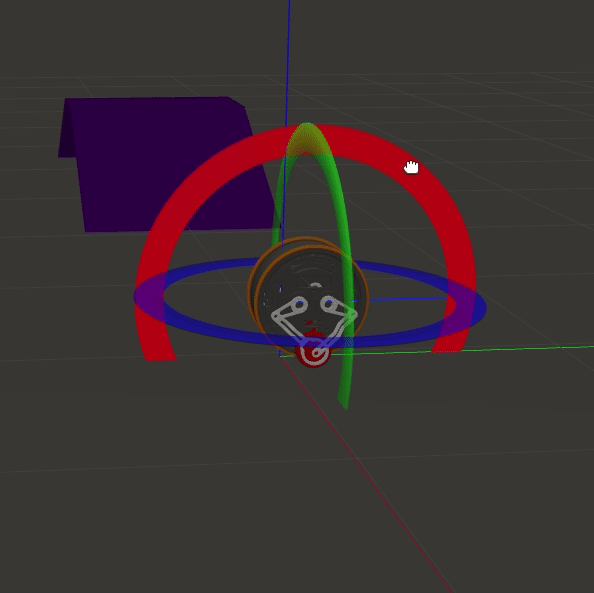

# robot_paper_sim
______________________________________________________
## robot view


* Author: yuquan <yuquanxu0713@gmail.com>

Example robots and code for interfacing Gazebo with ROS

## Tutorials

[ROS URDF](http://gazebosim.org/tutorials/?tut=ros_urdf)

## Quick Start

Rviz:

    roslaunch whell_describe display_urdf.launch

Gazebo:

    roslaunch whell_gazebo gazebo.launch

ROS Control:

    rosrun my_lqr_controller lqr_gazebo_controller

Example of Moving Joints:

    rostopic pub -1 /myrobot/leg1423_Effort_controller/command std_msgs/Float64MultiArray "data: [1.28,-1.28,-1.28,1.28]"


## 🕹 joy controlle

```
roslaunch joy_control_Twip_api Twip_joy.launch
```

## Develop and Contribute

Please see the code for detailed operations！

 Thanks for your help!

## balance



## other


## plot


